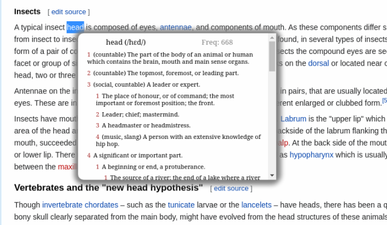
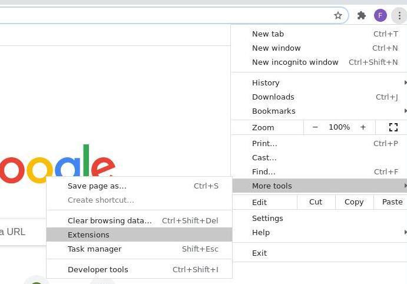
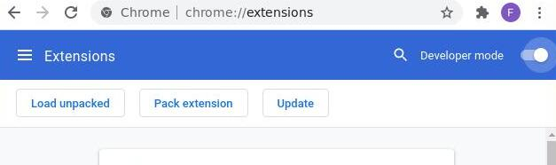

# Minerva Popup Dictionary

Minerva Popup Dictionary (MPD) is an extension for Chrome that lets users search for the meanings of a word by clicking on it.

<p align="left">
  
</p>


## Features
Minerva Popup Dictionary:
- works offline.
- includes the frequency of each word.
- includes the IPA transcription of each word based on Standard British English (Received Pronunciation).
- supports searching within the popup window.

## Dictionary Files
The dictionary files were obtained from Wiktionary by using [this parser](https://github.com/farleyoli/wiktionary-parser), written by the same author of this repository.

## Installation
To install MPD, first clone (or download) this repository to any location in your computer. To do this, open your terminal, and type the following.

```sh
git clone https://github.com/farleyoli/minerva-popup-dictionary
```

Then go to `More tools` followed by `Extensions` in the Chrome options menu.

<p align="left">
  
</p>

After enabling developer mode, click the `Load unpacked` button and select the directory where you have cloned the MPD repository.

<p align="left">
  
</p>

Congratulations! You are ready to start using MPD. Try double clicking any word in your browser.

## License
All the code in this repository (**excluding** the Wiktionary files) falls under the MIT license. The original texts of Wiktionary entries are dual-licensed to the public under both the Creative Commons Attribution-ShareAlike 3.0 Unported License (CC-BY-SA) and the GNU Free Documentation License (GFDL).
